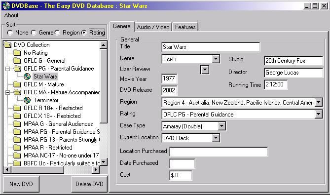



## DVDBase 0\.52

### Description

An update of my DVD database. I've changed the main navigation control to a treeview control and enabled some drag and drop functionality. Makes the software a fair bit easier to use.

It's worth a look if you want to learn treeviews and drag and drop.
 
### More Info
 

             |
---                |---
**Submitted On**   |2002-12-10 13:27:36
**By**             |[Mark Nemtsas](https://github.com/Planet-Source-Code/PSCIndex/blob/master/ByAuthor/mark-nemtsas.md)
**Level**          |Intermediate
**User Rating**    |5.0 (30 globes from 6 users)
**Compatibility**  |VB 6\.0
**Category**       |[Complete Applications](https://github.com/Planet-Source-Code/PSCIndex/blob/master/ByCategory/complete-applications__1-27.md)
**World**          |[Visual Basic](https://github.com/Planet-Source-Code/PSCIndex/blob/master/ByWorld/visual-basic.md)
**Archive File**   |[DVDBase\_0\_15151412182002\.zip](https://github.com/Planet-Source-Code/mark-nemtsas-dvdbase-0-52__1-41682/archive/master.zip)

